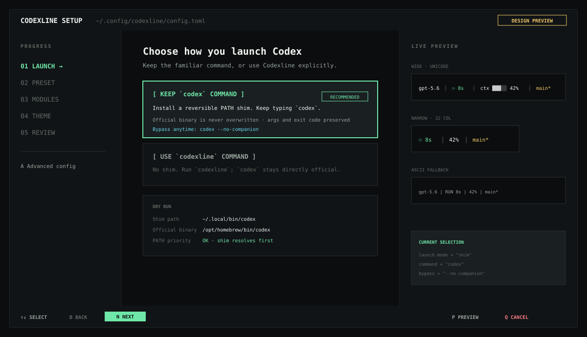
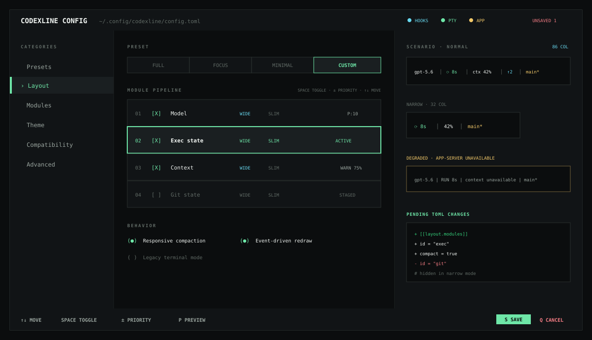
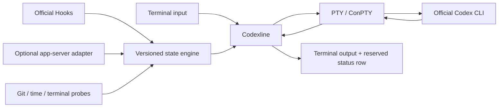

<p align="center">
  
</p>

<h1 align="center">Codexline</h1>

<p align="center">
  A fast, configurable, cross-platform companion status line for the official Codex CLI.
</p>

<p align="center">
  <code>macOS</code>&nbsp;&nbsp;<code>Linux</code>&nbsp;&nbsp;<code>Windows</code>&nbsp;&nbsp;<code>WSL</code>
</p>

> [!IMPORTANT]
> Codexline is currently an **unreleased M1 prototype**. PTY/ConPTY launch,
> passthrough fallback, a static responsive status row, preview, doctor, and
> launch-mode configuration are implemented. Rich modules and the visual
> configuration screens below remain the approved product direction.

Codexline keeps the state that matters visible—model, context pressure, active
work, agents, Git, permissions, and elapsed time—without modifying Codex or
requiring tmux.

Its quality bar is deliberately higher than the built-in footer: stronger
visual hierarchy, richer live state, responsive layouts, polished themes, and
clear degradation when a data source is unavailable. Recoloring the native
fields is not the product.

## Why Codexline?

| Stay oriented | Stay responsive | Stay compatible |
| --- | --- | --- |
| See what Codex is doing without interrupting the session. | Event-driven rendering keeps the terminal relay path fast. | Codexline wraps the official process and falls back safely when an integration is unavailable. |

## What you will see

```text
 Codex gpt-5.6 high │ ⟳ exec 8s │ ctx ▓▓▓░░ 42% │ ↑2 agents │ feat/pty *
```

The layout responds to available width:

```text
# Wide
Codex gpt-5.6 high │ ⟳ exec 8s │ ctx ▓▓▓░░ 42% │ ↑2 agents │ feat/pty *

# Narrow
⟳ exec 8s │ ctx 42% │ main*

# ASCII / no special glyphs
gpt-5.6 | RUN 8s | context 42% | main*
```

| Module | Signal |
| --- | --- |
| Model | Active model and reasoning effort |
| Work | Turn state, active tool, and elapsed time |
| Context | Context pressure, tokens, and warning thresholds when available |
| Agents | Active and completed subagents |
| Plan | Current step and task progress |
| Git | Branch, dirty state, staged files, and ahead/behind |
| Safety | Permission mode, sandbox, and degraded integrations |

Unknown data is hidden rather than rendered as a misleading zero.

The primary product direction is an `attached` layout directly below the Codex
composer. A compatibility-first `bottom` dock remains available, and `auto`
falls back to it whenever attached positioning is not trustworthy.

```text
┌─ Codex composer ──────────────────────────────────────────────┐
│ Implement {feature}                                          │
└──────────────────────────────────────────────────────────────┘
 Codex gpt-5.6 high │ ⟳ exec 8s │ ctx 42% │ ↑2 agents │ main *
```

## Try the prototype

The project currently builds with Rust 1.85 or newer:

```bash
cargo build
cargo run -- preview --width 100
cargo run -- doctor
cargo run -- run -- --help
```

Use an explicit binary when Codex is not discoverable on `PATH`:

```bash
CODEXLINE_CODEX_BIN=/absolute/path/to/codex cargo run -- run
```

Non-TTY output, `TERM=dumb`, CI, `codex exec`, small terminals, and
`--no-companion` automatically run the official Codex without an overlay.
Codexline is not yet published and does not install a shim in this milestone.

## Configure it visually

`codexline config` implements the complete five-step guided flow as a safe text
wizard with presets, module toggles, theme and glyph selection, wide/narrow
previews, and a final dry run. The advanced three-pane editor remains planned.

### 1. Guided setup

First choose how Codexline should launch, then select **Full**, **Focus**, or
**Minimal**, preview the result, and save. The guided flow targets first-time
setup and terminals as small as `80×24`.

<p align="center">
  
</p>

```text
Launch → Preset → Modules → Theme → Review → Save
```

The Launch step offers two explicit modes:

| Mode | Command you type | What Codexline changes |
| --- | --- | --- |
| Keep `codex` command (recommended) | `codex` | Installs a reversible user-level PATH shim; never overwrites the official binary |
| Use explicit companion command | `codexline` | Installs no `codex` shim; the official command remains directly selected by the shell |

Before saving, the wizard shows the proposed shim path, resolved official Codex
binary, PATH precedence, and a dry-run summary. In shim mode,
`codex --no-companion` bypasses the overlay and launches the official binary.
All other arguments and the child exit code pass through unchanged.

### 2. Advanced editor

Press `A` from the wizard to edit module order, priority, responsive visibility,
conditions, thresholds, scenarios, and pending TOML changes.

<p align="center">
  
</p>

The editor previews:

- wide and narrow terminal widths;
- Unicode, ASCII, monochrome, and reduced-motion modes;
- normal, warning, and degraded-data scenarios;
- the exact TOML changes before saving.

Implemented commands:

```text
codexline run -- ...   # run official Codex; arguments pass through unchanged
codexline config       # guided launch, preset, modules, theme, preview, review
codexline preview      # preview the current static responsive status line
codexline doctor       # inspect discovery, TTY state, backend, and config path
```

The prototype bottom dock supports configurable segment order and visibility in
`~/.config/codexline/config.toml`:

```toml
[display]
theme = "ox96f" # transparent 0x96f neon palette; "inherit" uses terminal colors
glyphs = "unicode"
refresh_hz = 8
rows = 3
segments = [
  "app", "model", "work", "context", "tokens", "rate-limits",
  "git", "worktree", "tools", "agents",
  "plan", "compactions", "safety", "elapsed", "cwd", "status"
]
separator = " │ "
```

Available segments are `app`, `model`, `work`, `context`, `tokens`,
`rate-limits`, `git`, `worktree`,
`tools`, `agents`, `plan`, `compactions`, `safety`, `elapsed`, `cwd`, and
`status`. Remove a name to hide it or reorder the array to move it. `inherit`
maps semantic colors through the terminal palette. `ox96f` uses the high-contrast
cyan, green, yellow, violet, and red 0x96f palette. Both remain transparent; the
fixed `codex-dark` and `codex-light` themes paint their own backgrounds.
`preview` uses clearly labelled simulated state to demonstrate the responsive
layout.

`rate-limits` is populated through a separate, read-only official Codex
app-server process. It shows the available 5-hour/weekly windows, remaining
percentage, explicit `reset 2d 5h` countdown, and reset credits. Disable that process without
affecting Codex or Hooks:

```toml
[sources]
app_server = false
remote_proxy = false
```

With `remote_proxy = true` (the default), Codexline starts an official loopback
app-server and transparently routes the TUI protocol through it. `context` and
`tokens` then consume `thread/tokenUsage/updated` from that same thread. Startup
or handshake failure falls back within 300 ms to the read-only capacity sidecar,
Hooks, and local probes. Codexline does not read private transcripts or scrape
the terminal.

With the optional local `codexline-events` plugin trusted, the HUD receives
tool, subagent, plan, approval, and compaction events from official Codex Hooks.
Without it, those unavailable fields remain hidden and Codexline falls back to
model, Git, worktree, safety, elapsed time, and directory probes.

Planned commands and extensions:

```text
codexline setup       # choose launch mode and install integration
codexline themes      # browse built-in themes
codexline uninstall   # remove only files created by Codexline
```

Advanced users will also be able to edit:

```toml
version = 1

[launch]
mode = "shim" # shim | explicit
bypass_flag = "--no-companion"

[display]
theme = "inherit"
glyphs = "unicode"
refresh_hz = 8

[telemetry]
mode = "auto" # auto | hooks | app-server | local-only

[[layout.left]]
module = "turn"
priority = 100

[[layout.center]]
module = "context"
style = "bar"
priority = 80

[[layout.right]]
module = "git"
priority = 70
```

The current launcher ignores an invalid configuration and starts Codex with
safe defaults. Last-known-good hot reload arrives with M2.

## How it works

Codexline is a thin terminal companion, not another Codex distribution.



If the real terminal has 40 rows and the Full preset reserves three lanes,
Codexline gives Codex a 37-row child PTY/ConPTY and owns the final three rows:

```text
Real terminal: 120 × 40
├─ Official Codex child terminal: 120 × 37
└─ Codexline HUD lanes:              rows 38–40
```

Codex output is forwarded as bytes. The relay does not wait for Git, JSON,
configuration, or rendering work.
For companion-managed interactive sessions, Codexline adds a process-local
`tui.status_line=[]` override so the native footer does not compete with the HUD.
An explicit user `-c tui.status_line=...` argument still wins, and bypassed or
non-interactive sessions remain untouched.

When shim mode is enabled, process resolution is:

```text
codex (user-level shim) → codexline → PTY/ConPTY → official codex
```

The installer verifies that the shim precedes the official binary in PATH,
records every file it creates, and provides a reversible uninstall. Explicit
mode skips the shim entirely.

### Data sources

1. **Official Hooks** provide stable lifecycle, model, tool, permission, and
   subagent events.
2. **app-server** can enhance token, context, plan, and thread state when the
   current Codex version supports it.
3. **Local probes** provide cached Git, time, version, and terminal state.

app-server support is optional. Failure falls back to Hooks, then local-only
state, without preventing Codex from starting.

For local development, add and install the bundled event adapter, then review
and trust its commands from `/hooks` in a new Codex session:

```text
codex plugin marketplace add /absolute/path/to/codex-cli-statusline/integrations
codex plugin add codexline-events@codexline-local
```

The adapter is inert unless Codex was launched by Codexline; event datagrams are
loopback-only, session-token authenticated, bounded, and never contain transcript
contents in Codexline state.

## Compatibility target

| Environment | Display backend | Fallback |
| --- | --- | --- |
| macOS | POSIX PTY + ANSI | Direct Codex execution |
| Linux | POSIX PTY + ANSI | Direct Codex execution |
| Windows 10+ | ConPTY + Virtual Terminal | Direct Codex execution |
| WSL | Linux PTY backend | Direct Codex execution |
| tmux / Zellij | Same PTY renderer | ASCII or no overlay |
| Non-TTY, CI, pipes | Overlay disabled | Original Codex behavior |

Target terminals include Terminal.app, iTerm2, Windows Terminal, Kitty,
WezTerm, Alacritty, VS Code, JetBrains, Warp, tmux, and Zellij. Compatibility
claims will be promoted from *target* to *verified* only after automated and
manual testing.

## Performance budget

| Path | Target |
| --- | ---: |
| Wrapper work before starting Codex | `< 20 ms` typical |
| Added terminal relay latency | `< 1 ms` |
| Status render | `< 0.5 ms` typical |
| Idle CPU without animation | Near zero |
| Default / maximum redraw rate | `8 / 20 FPS` |
| Hook execution | `< 5 ms` typical |
| Per-session memory | `< 20 MiB` target |

Every queue, protocol frame, subprocess, external module, and log buffer will
be bounded. Performance changes require before/after measurements.

## Safety and privacy

- No prompt, response, command-output, or transcript collection.
- No parsing of private Codex SQLite tables or rollout formats.
- No modification of the official Codex installation.
- Dynamic terminal text is sanitized against control-sequence injection.
- Local sockets and named pipes are restricted to the current user/session.
- External modules use argv arrays, timeouts, output caps, and concurrency
  limits; shell execution is opt-in.
- Installation and removal are reversible.

The invariant is simple: **Codex must remain usable when Codexline fails.**

## Project status

- [x] Architecture and compatibility design
- [x] Guided and advanced configuration UX
- [x] GitHub README visual direction
- [x] M1 prototype — PTY/ConPTY launch, resize, status row, direct fallback
- [ ] M1 hardening — signals, terminal-mode fixtures, Windows verification
- [x] M2 — Codex Hooks plugin and state engine
- [ ] M3 — app-server enhancement, modules, themes, and live configuration
- [ ] M4 — signed cross-platform installers, compatibility matrix, and `1.0`

See [DESIGN.md](DESIGN.md) for the implementation specification.

## Contributing

The repository is preparing for public development. Before changing
architecture or implementation, read:

- [AGENTS.md](AGENTS.md) — engineering, safety, testing, and GitHub workflow;
- [DESIGN.md](DESIGN.md) — product architecture and performance budgets.

Please open an issue or design note before changing PTY ownership, public state
schemas, plugin protocols, updater trust, or public configuration formats.

## Inspiration

The guided configuration and live-preview philosophy is inspired by
[Claude HUD](https://github.com/jarrodwatts/claude-hud). Codexline uses a
different process architecture because Codex does not currently expose a
command-backed custom status-line provider.

## License

Codexline is available under the [MIT License](LICENSE).
