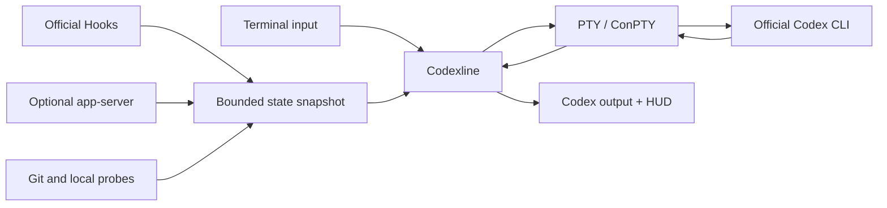

<p align="center">
  
</p>

<h1 align="center">codex-cli-codexline</h1>

<p align="center">
  A fast, attractive, configurable companion HUD for the official Codex CLI.
</p>

<p align="center">
  <a href="README.md">English</a> · <a href="README.zh-CN.md">简体中文</a>
</p>

> [!IMPORTANT]
> This repository is an **alpha**. macOS is locally tested. Linux, Windows 10+
> and WSL are supported targets covered by CI, but still need broader manual
> terminal testing. Codexline is an independent community project and is not
> affiliated with or endorsed by OpenAI.

`codex-cli-codexline` is the repository and package name. The installed command
is deliberately shorter: `codexline`.

Codexline launches the official Codex CLI inside a PTY/ConPTY and renders its
own responsive HUD at the bottom of the terminal. It does not patch Codex,
replace Codex, scrape the TUI, or require tmux.

## Highlights

- Model, reasoning, run state, active tools and elapsed time
- Context pressure, token counters, 5-hour and weekly usage limits
- Git branch, dirty/staged/modified counts, sync state and worktrees
- Live agents, plans, compactions, permissions and integration health
- Keyboard-first visual configuration with an anchored live preview
- 12 built-in themes, transparent palettes, Unicode and ASCII modes
- Safe degradation to official Codex when the overlay is unavailable
- No prompts, responses, transcripts or file contents are collected

Unknown values are hidden instead of being displayed as misleading zeroes.

## Screenshots

### Live HUD

<p align="center">
  
</p>

### Visual configuration

<p align="center">
  
</p>

The screenshots are illustrated interface examples. Colors and visible modules
depend on the selected theme, terminal width and data available from Codex.

## Requirements

Before installing Codexline, install and authenticate the official Codex CLI.
The `codex` executable must be available on `PATH`. Follow the current
instructions in the [official Codex repository](https://github.com/openai/codex).

Building from source currently requires:

- Git
- Rust 1.85 or newer
- A terminal with interactive TTY support

Prebuilt and signed binaries are planned. The current alpha installs from
source.

## Install

### macOS

Install Rust if necessary, then build and install Codexline:

```bash
xcode-select --install
curl --proto '=https' --tlsv1.2 -sSf https://sh.rustup.rs | sh
git clone https://github.com/YongshengWin/codex-cli-codexline.git
cd codex-cli-codexline
cargo install --path . --locked
codexline doctor
```

Restart the terminal if `cargo` or `codexline` is not immediately found.
Cargo normally installs commands into `~/.cargo/bin`.

### Linux

Install a compiler toolchain first. Debian and Ubuntu example:

```bash
sudo apt update
sudo apt install -y build-essential curl git pkg-config
curl --proto '=https' --tlsv1.2 -sSf https://sh.rustup.rs | sh
git clone https://github.com/YongshengWin/codex-cli-codexline.git
cd codex-cli-codexline
cargo install --path . --locked
codexline doctor
```

On Fedora, Arch or another distribution, install the equivalent C compiler,
linker, Git and Rust packages before running `cargo install`.

### Windows 10/11

Install the official Codex CLI, Git, Rustup and the Microsoft C++ Build Tools.
Then run in PowerShell:

```powershell
git clone https://github.com/YongshengWin/codex-cli-codexline.git
Set-Location codex-cli-codexline
cargo install --path . --locked
codexline doctor
```

The installed program is `codexline.exe`, usually under
`%USERPROFILE%\.cargo\bin`. Native Windows uses ConPTY and Virtual Terminal
sequences. Windows support is alpha until the terminal recovery and signal
matrix has been manually verified on more machines.

### WSL

Install Codex and Codexline inside the same WSL distribution. Follow the Linux
steps above; do not reuse the Windows `.exe` from the Linux shell.

### Install directly after the repository is public

Users who do not need a local clone can run:

```bash
cargo install --git https://github.com/YongshengWin/codex-cli-codexline --locked --bin codexline
```

## Configure and run

The normal first-run sequence is:

```bash
codexline config
codexline doctor
codexline
```

`codexline` starts the official Codex CLI with the companion HUD. Arguments can
be forwarded explicitly:

```bash
codexline run -- --help
codexline run -- resume --last
```

To run official Codex through Codexline without drawing the HUD:

```bash
codexline run -- --no-companion
```

Non-TTY output, `TERM=dumb`, CI, `codex exec`, very small terminals and explicit
bypass automatically use direct Codex behavior without the overlay.

| Command | Purpose |
| --- | --- |
| `codexline` | Start interactive Codex with the HUD |
| `codexline run -- <args>` | Forward arguments to official Codex |
| `codexline config` | Open visual configuration and live preview |
| `codexline preview` | Render a simulated HUD without starting Codex |
| `codexline doctor` | Show paths, Codex discovery, backend and data-source status |

> [!NOTE]
> The configuration UI can record the future “keep typing `codex`” shim mode,
> but this alpha does not install that shim yet. Until `codexline setup` lands,
> launch interactive sessions with `codexline`.

## Configuration UI

Run `codexline config`. Changes remain staged until saved.

| Key | Action |
| --- | --- |
| `Tab` / `Shift+Tab` | Change the primary section |
| `↑` / `↓` | Move between navigation levels or options |
| `←` / `→` | Change the active tab at the current level |
| `Space` | Toggle or select an option |
| `Enter` | Validate and save from anywhere |
| `Esc` | Cancel without saving |

For a line-by-line accessible fallback:

```bash
CODEXLINE_CONFIG_LINEAR=1 codexline config
```

PowerShell:

```powershell
$env:CODEXLINE_CONFIG_LINEAR = "1"
codexline config
```

Configuration paths:

| System | Default path |
| --- | --- |
| macOS / Linux / WSL | `~/.config/codexline/config.toml` |
| Unix with `XDG_CONFIG_HOME` | `$XDG_CONFIG_HOME/codexline/config.toml` |
| Windows | Printed by `codexline doctor`; normally `%APPDATA%\codexline\codexline\config\config.toml` |

## Themes

Transparent themes preserve the terminal background:

- Inherit terminal
- 0x96f Neon
- Tokyo Night
- Catppuccin Mocha
- Dracula
- Nord
- Gruvbox
- Rosé Pine

Codex Dark and Codex Light use fixed backgrounds. Minimal and Mono provide
reduced styling. Select and preview every theme from **Appearance** in
`codexline config`.

## Live agents

When Codex exposes active subagents, Codexline expands an Agent Inspector below
the main HUD. The HUD displays a visible `Ctrl+G focus` action:

1. Press `Ctrl+G` to focus the inspector.
2. Use `↑` and `↓` to select an agent.
3. Press `Enter` to view its goal and latest available message.
4. Press `Esc` to go back or close the inspector.

Fields unavailable from the current Codex integration are omitted.

## Optional Hooks integration

The bundled `codexline-events` plugin supplies tool, agent, plan, approval and
compaction events. From a cloned repository:

```bash
codex plugin marketplace add "$PWD/integrations"
codex plugin add codexline-events@codexline-local
```

PowerShell:

```powershell
codex plugin marketplace add "$PWD\integrations"
codex plugin add codexline-events@codexline-local
```

Review and trust the commands through `/hooks` in a new Codex session. The
adapter is inert when Codexline is not running.

## Data sources

Codexline combines three bounded sources:

1. Official Hooks for lifecycle, tools, permissions and agents.
2. An optional read-only app-server sidecar for usage limits and account state.
3. Cached local probes for Git, worktrees, directory and elapsed time.

The default `safe sidecar` mode does not put a proxy between the TUI and Codex.
`remote_proxy = true` is experimental and can terminate the interactive TUI if
an established proxy connection disconnects. It is disabled by default.

## How it works



Codexline reserves HUD rows from the child terminal size, forwards Codex output
as bytes and keeps rendering work away from the relay path. It disables the
native Codex footer only for the companion-managed process. An explicit user
`-c tui.status_line=...` override remains authoritative.

## Compatibility and current limits

| Environment | Backend | Current confidence |
| --- | --- | --- |
| macOS | POSIX PTY + ANSI | Locally tested |
| Linux | POSIX PTY + ANSI | CI target; manual matrix pending |
| Windows 10/11 | ConPTY + Virtual Terminal | CI target; manual matrix pending |
| WSL | Linux PTY backend | Target; manual matrix pending |
| Non-TTY / CI / pipes | Direct fallback | Automated tests |

Current alpha limitations:

- No signed prebuilt binaries or package-manager formulae yet.
- `codexline setup`, automatic `codex` shim installation and uninstall are not
  implemented yet.
- The stable renderer uses a bottom dock; attached composer placement remains
  experimental product work.
- Rich live fields depend on the capabilities exposed by the installed Codex
  version and optional Hooks integration.

## Privacy and safety

- No prompt, response, transcript, command output or file-content collection.
- No private Codex SQLite or rollout format parsing.
- No modification of the official Codex installation.
- Dynamic display text is sanitized against terminal control injection.
- Integration messages are local, bounded and scoped to the current session.
- Failures before PTY ownership fall back to direct Codex execution.

## Development and coding agents

Start with these documents:

- [`AGENTS.md`](AGENTS.md): mandatory contributor and coding-agent rules in
  English, Chinese and Japanese.
- [`DESIGN.md`](DESIGN.md): architecture, compatibility, security and
  performance invariants.
- [`docs/adr`](docs/adr): accepted architectural decisions.

Required verification:

```bash
cargo fmt --all -- --check
cargo clippy --workspace --all-targets --all-features -- -D warnings
cargo test --workspace --all-features
cargo build --release
```

Keep implemented behavior, proposals and platform verification clearly
separated. Do not patch Codex, scrape terminal text or read private transcripts.

## Contributing

Issues and pull requests are welcome. Open an issue before changing PTY
ownership, public configuration, plugin protocols, updater trust or state
schemas. PRs should describe tested platforms, fallback behavior, security
impact and verification commands.

## License

MIT. See [`LICENSE`](LICENSE).
