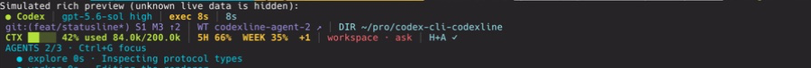
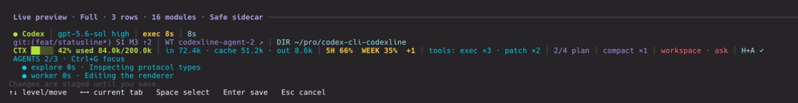
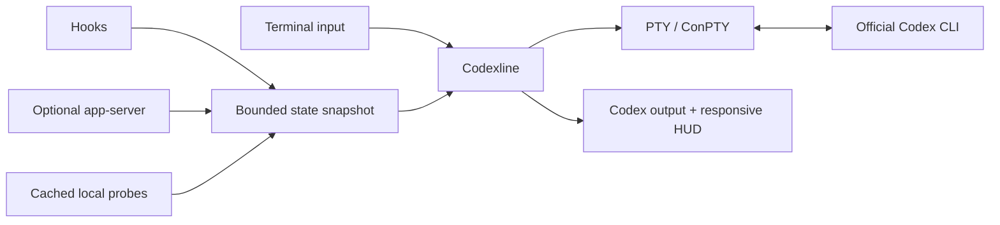

# Codexline

A fast, configurable companion HUD for the official Codex CLI. More context at
a glance, without modifying Codex or your terminal theme.

[English](README.md) · [简体中文](README.zh-CN.md)

Codexline runs the official Codex CLI inside a PTY/ConPTY and adds a responsive
status area at the bottom of the terminal. It shows model, context, limits, Git,
worktrees, tools, plans and live agents—then gets out of the way when data or
terminal capabilities are unavailable.

> Independent community project. Not affiliated with or endorsed by OpenAI.

## 1. Quick start

You only need the official `codex` command. The installer downloads a
precompiled Codexline binary for your system and verifies its SHA-256 checksum;
Rust and Cargo are not required.

**macOS / Linux / WSL**

```bash
curl --proto '=https' --tlsv1.2 -fsSL \
  https://raw.githubusercontent.com/YongshengWin/codex-cli-codexline/main/scripts/install.sh | sh
```

**Windows 10/11 PowerShell**

```powershell
irm https://raw.githubusercontent.com/YongshengWin/codex-cli-codexline/main/scripts/install.ps1 | iex
```

Then open a new terminal and run:

```bash
codexline config
codexline doctor
codexline
```

That is the complete first-run flow: **install → configure → verify → start**.
Codexline installs as a separate `codexline` command and never overwrites the
official `codex` executable.

### Updating an existing installation

Run the same installer again. It replaces only the managed executable and
preserves your configuration:

```bash
curl --proto '=https' --tlsv1.2 -fsSL \
  https://raw.githubusercontent.com/YongshengWin/codex-cli-codexline/main/scripts/install.sh | sh
codexline doctor
```

On Windows, rerun the PowerShell command above. To install a specific release,
set `CODEXLINE_VERSION=v0.1.0` on macOS/Linux, or download that release with the
PowerShell script's `-Version` parameter. Pastel Syntax is the default for new
configurations; existing theme choices are intentionally preserved.

| Command | What it does |
| --- | --- |
| `codexline` | Start interactive Codex with the HUD |
| `codexline config` | Configure modules, layout, themes and data sources |
| `codexline doctor` | Check Codex discovery, terminal backend and integrations |
| `codexline preview` | Preview the HUD without starting Codex |
| `codexline run -- <args>` | Forward arguments to the official Codex CLI |
| `codexline run -- --no-companion` | Run official Codex without the HUD |

## 2. What it looks like

### 2.1 Running HUD



### 2.2 Keyboard-first configuration with live preview



These are privacy-safe crops of the terminal content only—no cmux chrome,
sidebars, tabs or personal workspace data. The background comes from the
terminal; visible rows and fields adapt to width, theme and available Codex
data.

## 3. What Codexline adds

| Area | Available information |
| --- | --- |
| Session | Model, reasoning effort, run state, current tool, elapsed time |
| Usage | Context used, input/cache/output tokens, 5-hour and weekly limits, reset time |
| Workspace | Directory, project root, Git branch, dirty/staged/modified counts, ahead/behind, worktree |
| Activity | Recent tools, plan progress, compactions, active/total agents |
| Runtime | Sandbox, approval mode, permissions, data-source health |

### Data freshness

Codexline never presents an independent sidecar as the active Codex session.
Its health labels describe the actual source:

| Label | Meaning |
| --- | --- |
| `ACCOUNT` | Independent read-only app-server used for account limits only |
| `HOOK` | The active Codex session has delivered a supported lifecycle event |
| `LIVE` | The loopback relay is observing the active Codex session directly |
| `LIVE !` | Live startup or transport failed; stale live data is no longer shown |
| `default` / `start` | Startup value; not yet confirmed by a runtime event |

Model, reasoning and permission changes persisted by Codex are refreshed within
about three seconds. Git/worktree state is also refreshed every three seconds
off the PTY relay path. Hooks refresh model, directory, work and permission mode
on the next supported event. Context and token values are hidden after a turn
starts unless the active-session relay supplies `thread/tokenUsage/updated`;
Codexline does not invent those values. The context bar uses the latest model
request, while input/cache/output counters are cumulative for the session.

Choose **Data → Live relay** in `codexline config` for exact active-session
tokens, tools, plans, compactions and subagent events. It binds only to loopback
and forwards unknown JSON-RPC methods unchanged. If app-server is unavailable
before Codex launches, Codexline falls back to the normal session. A connection
lost after the official CLI has attached cannot be hot-switched, so Codexline
shows `LIVE !` instead of silently retaining stale values.

When Codex exposes subagent activity, the Agent Inspector expands below the main
HUD. Press `F2`, select an agent with `↑`/`↓`, and press `Enter` to inspect
its goal and latest available message. Unknown fields are omitted rather than
rendered as misleading zeroes.

Other design choices:

- 13 built-in themes, transparent palettes, Unicode and ASCII modes
- Responsive one-to-three-row layouts with width-aware truncation
- Native Codex footer detection and companion-scoped suppression
- Direct fallback for pipes, CI, `TERM=dumb`, tiny terminals and explicit bypass
- No tmux requirement and no patching of the Codex installation
- No prompt, response, transcript or file-content collection

## 4. Configure it

Run:

```bash
codexline config
```

The configuration screen stages every change and keeps a live preview anchored
at the bottom.

| Key | Action |
| --- | --- |
| `Tab` / `Shift+Tab` | Move between primary sections |
| `↑` / `↓` | Move between navigation levels and options |
| `←` / `→` | Change the tab at the current level |
| `Space` | Toggle the selected option |
| `Enter` | Validate and save from anywhere |
| `Esc` | Exit without saving |

Themes include Inherit Terminal, 0x96f Neon, Tokyo Night, Catppuccin Mocha,
Dracula, Nord, Gruvbox, Rosé Pine, Pastel Syntax, Codex Dark, Codex Light,
Minimal and Mono. **Pastel Syntax is the default**: it uses the requested soft
syntax palette with a pink context progress indicator. Transparent themes
preserve the terminal's original background.

For a line-by-line accessible fallback:

```bash
CODEXLINE_CONFIG_LINEAR=1 codexline config
```

Configuration is stored at `~/.config/codexline/config.toml` on macOS,
Linux and WSL. On Windows, run `codexline doctor` to print the resolved path.

### Optional live events

The bundled `codexline-events` integration supplies fresher model, directory,
permission, tool, agent, plan,
approval and compaction events. From a cloned repository:

```bash
codex plugin marketplace add "$PWD/integrations"
codex plugin add codexline-events@codexline-local
```

Review the commands through `/hooks` in a new Codex session. The adapter is
inactive when Codexline is not running.

## 5. Install by platform

### 5.1 macOS

```bash
curl --proto '=https' --tlsv1.2 -fsSL \
  https://raw.githubusercontent.com/YongshengWin/codex-cli-codexline/main/scripts/install.sh | sh
```

The native Apple Silicon or Intel binary is installed to `~/.local/bin`. If
that directory is not already on `PATH`, the installer prints the exact export
command to add to your shell profile.

### 5.2 Linux and WSL

```bash
curl --proto '=https' --tlsv1.2 -fsSL \
  https://raw.githubusercontent.com/YongshengWin/codex-cli-codexline/main/scripts/install.sh | sh
```

The installer supports x86_64 and arm64 with portable musl builds. Install
Codex and Codexline inside the same WSL distribution; do not invoke the Windows
`.exe` from a Linux shell.

### 5.3 Windows 10/11

Run in PowerShell without administrator privileges:

```powershell
irm https://raw.githubusercontent.com/YongshengWin/codex-cli-codexline/main/scripts/install.ps1 | iex
```

The x64 executable is installed under `%LOCALAPPDATA%\Codexline\bin`; the
installer adds that directory to the current user's `PATH`. Open a new terminal
after the first installation. Native Windows uses ConPTY.

### 5.4 Uninstall

macOS / Linux / WSL:

```bash
rm "$HOME/.local/bin/codexline"
```

Windows PowerShell:

```powershell
Remove-Item "$env:LOCALAPPDATA\Codexline\bin\codexline.exe"
```

You may also remove the now-empty directory from your user `PATH`.

### 5.5 Developer installation from source

Cargo is an optional developer channel. It compiles Codexline locally and
requires Rust 1.85+, Git and the platform build toolchain:

```bash
# Install from a clone
cargo install --path . --locked

# Install or update directly from main
cargo install --git https://github.com/YongshengWin/codex-cli-codexline --locked --bin codexline --force

# Remove a Cargo-managed installation
cargo uninstall codex-cli-codexline
```

## 6. Compatibility and release status

The current version is `0.1.0`. GitHub Releases provide checksum-verified
precompiled archives; code signing and package-manager formulae remain future
release-hardening work.

| Environment | Backend | Verification |
| --- | --- | --- |
| macOS arm64 | POSIX PTY + ANSI | Tests, release build, installation and interactive terminal use |
| Debian 12 x86_64 | POSIX PTY + ANSI | Rust 1.85.1 tests, release build, PTY, Ctrl+C, recovery and config TUI |
| Other Linux | POSIX PTY + ANSI | Shared backend; broader distribution matrix pending |
| Windows 10/11 x64 | ConPTY + VT | CI build/tests; real-host runtime test pending |
| WSL | Linux PTY | Shared backend; Windows Terminal boundary test pending |
| Pipes / CI / non-TTY | Direct fallback | Automated tests |

See [platform verification](docs/platform-verification.md) for exact evidence.
Automatic `codex` shim installation is not implemented yet; use the explicit
`codexline` command. Rich live fields depend on the installed Codex version and
enabled integration surfaces.

## 7. How it works



Codexline reserves HUD rows from the child terminal size and forwards Codex
traffic independently from Git probes and rendering. If the overlay cannot be
used safely, Codex remains available through direct execution.

## 8. Development, agents and contribution

This repository is designed to be readable by both humans and coding agents.
Start in this order:

1. [`AGENTS.md`](AGENTS.md) — mandatory English/Chinese/Japanese working rules.
2. [`DESIGN.md`](DESIGN.md) — architecture, performance, compatibility and safety invariants.
3. [`docs/adr`](docs/adr) — accepted architecture decisions.
4. [`docs/platform-verification.md`](docs/platform-verification.md) — claims and test evidence.

Required checks:

```bash
cargo fmt --all -- --check
cargo clippy --workspace --all-targets --all-features -- -D warnings
cargo test --workspace --all-features
cargo build --release
```

Issues and pull requests are welcome. Open an issue before changing PTY
ownership, public configuration, integration protocols or updater trust.

MIT licensed. See [`LICENSE`](LICENSE).
