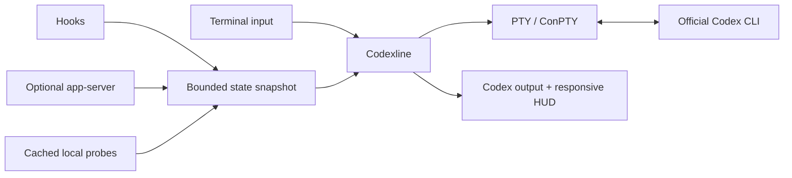

# Codexline

A fast, configurable companion HUD for the official Codex CLI. More context at
a glance, without modifying Codex or your terminal theme.

[English](README.md) · [简体中文](README.zh-CN.md)

Codexline runs the official Codex CLI inside a PTY/ConPTY and adds a responsive
status area at the bottom of the terminal. It shows model, context, limits, Git,
worktrees, tools, plans and live agents—then gets out of the way when data or
terminal capabilities are unavailable.

> Independent community project. Not affiliated with or endorsed by OpenAI.

## 1. Quick start

You need the official `codex` command, Git and Rust 1.85+.

```bash
cargo install --git https://github.com/YongshengWin/codex-cli-codexline --locked --bin codexline
codexline config
codexline doctor
codexline
```

That is the complete first-run flow: **install → configure → verify → start**.
Codexline installs as a separate `codexline` command and never overwrites the
official `codex` executable.

| Command | What it does |
| --- | --- |
| `codexline` | Start interactive Codex with the HUD |
| `codexline config` | Configure modules, layout, themes and data sources |
| `codexline doctor` | Check Codex discovery, terminal backend and integrations |
| `codexline preview` | Preview the HUD without starting Codex |
| `codexline run -- <args>` | Forward arguments to the official Codex CLI |
| `codexline run -- --no-companion` | Run official Codex without the HUD |

## 2. What it looks like

### 2.1 Running HUD


### 2.2 Keyboard-first configuration with live preview


These are privacy-safe crops of the terminal content only—no cmux chrome,
sidebars, tabs or personal workspace data. The background comes from the
terminal; visible rows and fields adapt to width, theme and available Codex
data.

## 3. What Codexline adds

| Area | Available information |
| --- | --- |
| Session | Model, reasoning effort, run state, current tool, elapsed time |
| Usage | Context pressure, input/cache/output tokens, 5-hour and weekly limits, reset time |
| Workspace | Directory, project root, Git branch, dirty/staged/modified counts, ahead/behind, worktree |
| Activity | Recent tools, plan progress, compactions, active/total agents |
| Runtime | Sandbox, approval mode, permissions, data-source health |

When Codex exposes subagent activity, the Agent Inspector expands below the main
HUD. Press `Ctrl+G`, select an agent with `↑`/`↓`, and press `Enter` to inspect
its goal and latest available message. Unknown fields are omitted rather than
rendered as misleading zeroes.

Other design choices:

- 12 built-in themes, transparent palettes, Unicode and ASCII modes
- Responsive one-to-three-row layouts with width-aware truncation
- Native Codex footer detection and companion-scoped suppression
- Direct fallback for pipes, CI, `TERM=dumb`, tiny terminals and explicit bypass
- No tmux requirement and no patching of the Codex installation
- No prompt, response, transcript or file-content collection

## 4. Configure it

Run:

```bash
codexline config
```

The configuration screen stages every change and keeps a live preview anchored
at the bottom.

| Key | Action |
| --- | --- |
| `Tab` / `Shift+Tab` | Move between primary sections |
| `↑` / `↓` | Move between navigation levels and options |
| `←` / `→` | Change the tab at the current level |
| `Space` | Toggle the selected option |
| `Enter` | Validate and save from anywhere |
| `Esc` | Exit without saving |

Themes include Inherit Terminal, 0x96f Neon, Tokyo Night, Catppuccin Mocha,
Dracula, Nord, Gruvbox, Rosé Pine, Codex Dark, Codex Light, Minimal and Mono.
Transparent themes preserve the terminal's original background.

For a line-by-line accessible fallback:

```bash
CODEXLINE_CONFIG_LINEAR=1 codexline config
```

Configuration is stored at `~/.config/codexline/config.toml` on macOS,
Linux and WSL. On Windows, run `codexline doctor` to print the resolved path.

### Optional live events

The bundled `codexline-events` integration supplies richer tool, agent, plan,
approval and compaction events. From a cloned repository:

```bash
codex plugin marketplace add "$PWD/integrations"
codex plugin add codexline-events@codexline-local
```

Review the commands through `/hooks` in a new Codex session. The adapter is
inactive when Codexline is not running.

## 5. Install by platform

### 5.1 macOS

With Rust already installed:

```bash
cargo install --git https://github.com/YongshengWin/codex-cli-codexline --locked --bin codexline
codexline config
```

Without Rust, install the Apple command-line tools and Rust first:

```bash
xcode-select --install
curl --proto '=https' --tlsv1.2 -sSf https://sh.rustup.rs | sh
source "$HOME/.cargo/env"
```

### 5.2 Linux

Debian/Ubuntu example:

```bash
sudo apt update
sudo apt install -y build-essential curl git pkg-config
curl --proto '=https' --tlsv1.2 -sSf https://sh.rustup.rs | sh
source "$HOME/.cargo/env"
cargo install --git https://github.com/YongshengWin/codex-cli-codexline --locked --bin codexline
```

Use the equivalent compiler, linker, Git and Rust packages on other
distributions.

### 5.3 Windows 10/11

Install Git, Rustup and Microsoft C++ Build Tools, then run in PowerShell:

```powershell
cargo install --git https://github.com/YongshengWin/codex-cli-codexline --locked --bin codexline
codexline doctor
codexline config
```

Cargo installs `codexline.exe`, normally under `%USERPROFILE%\.cargo\bin`.
Native Windows uses ConPTY; see the verification table below before relying on
it for critical work.

### 5.4 WSL

Install Codex and Codexline inside the same WSL distribution and follow the
Linux instructions. Do not invoke the Windows `.exe` from the Linux shell.

### 5.5 Local source, update and uninstall

```bash
# Install from a clone
cargo install --path . --locked

# Update a Git installation
cargo install --git https://github.com/YongshengWin/codex-cli-codexline --locked --bin codexline --force

# Remove it
cargo uninstall codex-cli-codexline
```

## 6. Compatibility and release status

The current version is `0.1.0`: usable on the verified paths below, but not yet
a polished stable release with signed prebuilt binaries and package-manager
formulae.

| Environment | Backend | Verification |
| --- | --- | --- |
| macOS arm64 | POSIX PTY + ANSI | Tests, release build, installation and interactive terminal use |
| Debian 12 x86_64 | POSIX PTY + ANSI | Rust 1.85.1 tests, release build, PTY, Ctrl+C, recovery and config TUI |
| Other Linux | POSIX PTY + ANSI | Shared backend; broader distribution matrix pending |
| Windows 10/11 | ConPTY + VT | Rust 1.85.1 cross-check passes; real-host runtime test pending |
| WSL | Linux PTY | Shared backend; Windows Terminal boundary test pending |
| Pipes / CI / non-TTY | Direct fallback | Automated tests |

See [platform verification](docs/platform-verification.md) for exact evidence.
Automatic `codex` shim installation is not implemented yet; use the explicit
`codexline` command. Rich live fields depend on the installed Codex version and
enabled integration surfaces.

## 7. How it works



Codexline reserves HUD rows from the child terminal size and forwards Codex
traffic independently from Git probes and rendering. If the overlay cannot be
used safely, Codex remains available through direct execution.

## 8. Development, agents and contribution

This repository is designed to be readable by both humans and coding agents.
Start in this order:

1. [`AGENTS.md`](AGENTS.md) — mandatory English/Chinese/Japanese working rules.
2. [`DESIGN.md`](DESIGN.md) — architecture, performance, compatibility and safety invariants.
3. [`docs/adr`](docs/adr) — accepted architecture decisions.
4. [`docs/platform-verification.md`](docs/platform-verification.md) — claims and test evidence.

Required checks:

```bash
cargo fmt --all -- --check
cargo clippy --workspace --all-targets --all-features -- -D warnings
cargo test --workspace --all-features
cargo build --release
```

Issues and pull requests are welcome. Open an issue before changing PTY
ownership, public configuration, integration protocols or updater trust.

MIT licensed. See [`LICENSE`](LICENSE).
