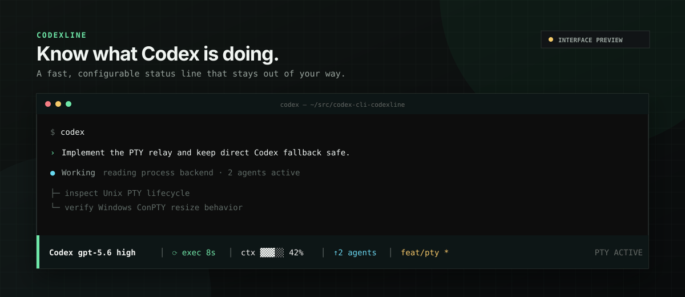
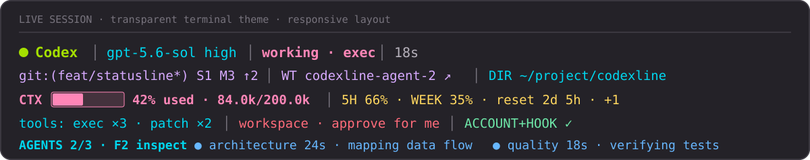
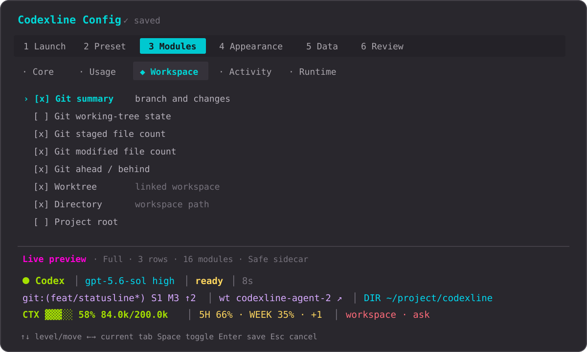
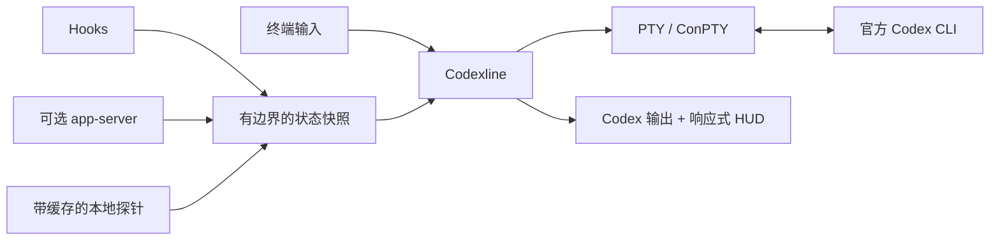

# Codexline

面向官方 Codex CLI 的快速、易配置伴生 HUD。不修改 Codex，不破坏终端主题，
让关键信息始终一眼可见。

[English](README.md) · [简体中文](README.zh-CN.md)

Codexline 在 PTY/ConPTY 中运行官方 Codex CLI，并在终端底部增加响应式状态区域。
模型、上下文、额度、Git、worktree、工具、计划和子代理都能集中展示；终端能力或
数据不足时则自动隐藏或降级，不妨碍 Codex 本身运行。

> 独立社区项目，与 OpenAI 不存在隶属或官方背书关系。

## 1. 快速开始

普通用户只需准备官方 `codex` 命令。安装器会下载适合当前系统的预编译文件并校验
SHA-256，不要求安装 Rust、Cargo 或本地编译工具链。

**macOS / Linux / WSL**

```bash
curl --proto '=https' --tlsv1.2 -fsSL \
  https://raw.githubusercontent.com/YongshengWin/codex-cli-codexline/main/scripts/install.sh | sh
```

**Windows 10/11 PowerShell**

```powershell
irm https://raw.githubusercontent.com/YongshengWin/codex-cli-codexline/main/scripts/install.ps1 | iex
```

打开新终端后执行：

```bash
codexline config
codexline doctor
codex
```

完整首次流程就是：**安装 → 配置 → 检查 → 启动**。Codexline 主程序仍是独立的
`codexline`；默认配置只会在 Codexline 自有用户目录创建名为 `codex` 的链接/副本，
绝不会覆盖官方程序。选择“显式使用 codexline”时只删除这个有所有权标记的 shim。

### 更新已有安装

重新执行同一条安装命令即可。安装器只替换其管理的程序文件，不会覆盖已有配置：

```bash
curl --proto '=https' --tlsv1.2 -fsSL \
  https://raw.githubusercontent.com/YongshengWin/codex-cli-codexline/main/scripts/install.sh | sh
codexline doctor
```

Windows 重新执行上面的 PowerShell 命令。macOS/Linux 可通过
`CODEXLINE_VERSION=v0.1.0` 安装指定版本，PowerShell 脚本则支持 `-Version` 参数。
Pastel Syntax 是新配置的默认主题，已有安装的主题选择会被保留。

| 命令 | 功能 |
| --- | --- |
| `codexline` | 启动带 HUD 的交互式 Codex |
| `codexline config` | 配置模块、布局、主题和数据源 |
| `codexline doctor` | 检查 Codex 路径、终端后端和集成状态 |
| `codexline preview` | 不启动 Codex，直接预览 HUD |
| `codexline run -- <参数>` | 将参数转发给官方 Codex CLI |
| `codexline run -- --no-companion` | 临时关闭 HUD，运行官方 Codex |
| `codex --no-companion` | 已启用自有 shim 时临时绕过 HUD |

## 2. 实际效果

### 2.1 运行中的 HUD



### 2.2 键盘配置与固定底部实时预览



以上为界面示意图。Codexline 沿用当前终端背景，行数与字段会根据终端宽度、
所选主题和 Codex 当前能够提供的数据自动调整。

## 3. Codexline 能展示什么

| 分类 | 可展示信息 |
| --- | --- |
| 会话 | 模型、推理等级、运行状态、当前工具、耗时 |
| 用量 | 已使用上下文、输入/缓存/输出 Token、5 小时与周额度、重置时间 |
| 工作区 | 目录、项目根目录、Git 分支、脏/暂存/修改数量、ahead/behind、worktree |
| 活动 | 最近工具、计划进度、压缩次数、活动/总子代理数量 |
| 运行环境 | 沙箱、审批模式、权限和数据源健康状态 |

### 数据新鲜度

Codexline 不会把独立 sidecar 伪装成当前 Codex 会话。健康标签直接说明真实来源：

| 标签 | 含义 |
| --- | --- |
| `ACCOUNT` | 只用于账户额度的独立只读 app-server |
| `HOOK` | 当前 Codex 会话已经送达受支持的生命周期事件 |
| `LIVE` | 本机回环中继正在直接观察当前 Codex 会话 |
| `LIVE !` | 实时启动或传输失败；不再继续展示过期实时数据 |
| `default` / `start` | 启动值，尚未被运行时事件确认 |

Codex 持久化模型、推理等级和权限选择后，Codexline 通常会在约三秒内刷新；Git 与
worktree 也每三秒在 PTY 转发路径之外刷新。Hook 会在下一个受支持事件中刷新模型、
目录、工作状态和权限模式。首轮开始后，如果实时中继没有收到官方
`thread/tokenUsage/updated`，CTX 与 Token 会隐藏，不会编造。上下文进度条表示最近
一次模型请求，输入/缓存/输出 Token 则是当前会话的累计值。

在 `codexline config` 中选择 **Data → Live relay**，即可获得当前会话的精确 Token、
工具、计划、压缩和子代理事件。中继只监听本机回环地址，未知 JSON-RPC method 会
原样转发。app-server 若在 Codex 启动前不可用，会自动回退到普通会话。官方 CLI
连接成功后若传输中断，目前无法无损热切换，因此会明确显示 `LIVE !`，而不是悄悄
保留旧值。

Codex 暴露子代理活动时，Agent Inspector 会在主 HUD 下展开。按 `F2` 聚焦，
用 `↑`/`↓`（或 `j`/`k`）选择，按 `→` 查看有边界的目标/最新状态；按 `Enter` 会打开
Codex 官方 `/agent` 选择器，用于完整线程查看和切换。未知字段会隐藏，不伪造零值。

其他关键能力：

- 13 套内置主题、透明配色、Unicode 与 ASCII 模式
- 根据终端宽度自动截断的一至三行布局
- 检测原生 Codex footer，并仅在伴生会话内关闭它
- 管道、CI、`TERM=dumb`、极小终端和显式旁路自动降级
- 不依赖 tmux，不修改官方 Codex 安装
- 不持久化或遥测上传提示词、回复、会话记录或文件内容

## 4. 配置

执行：

```bash
codexline config
```

配置界面会暂存全部改动，并把实时预览固定在屏幕底部。

| 按键 | 功能 |
| --- | --- |
| `Tab` / `Shift+Tab` | 切换一级功能页 |
| `↑` / `↓` | 在导航层级和选项之间移动 |
| `←` / `→` | 切换当前层级的标签页 |
| `Space` | 勾选或取消当前选项 |
| `Enter` | 在任意位置校验并保存 |
| `Esc` | 不保存并退出 |

主题包括 Inherit Terminal、0x96f Neon、Tokyo Night、Catppuccin Mocha、
Dracula、Nord、Gruvbox、Rosé Pine、Pastel Syntax、Codex Dark、Codex Light、
Minimal 和 Mono。**Pastel Syntax 是默认主题**，使用图示的柔和语法色，并以粉色
显示上下文进度。透明主题会保留终端原有背景。

需要逐行交互的无障碍兼容模式时：

```bash
CODEXLINE_CONFIG_LINEAR=1 codexline config
```

macOS、Linux 和 WSL 的配置默认位于 `~/.config/codexline/config.toml`。
Windows 请运行 `codexline doctor` 查看解析后的实际路径。

### 可选实时事件集成

仓库内置的 `codexline-events` 集成可以刷新模型、目录、权限，并补充工具、子代理、
计划、审批和压缩事件。
在克隆的仓库内执行：

```bash
codex plugin marketplace add "$PWD/integrations"
codex plugin add codexline-events@codexline-local
```

在新的 Codex 会话中通过 `/hooks` 检查命令。Codexline 未运行时，适配器不会工作。

## 5. 分系统安装

### 5.1 macOS

```bash
curl --proto '=https' --tlsv1.2 -fsSL \
  https://raw.githubusercontent.com/YongshengWin/codex-cli-codexline/main/scripts/install.sh | sh
```

安装器自动选择 Apple Silicon 或 Intel 版本，并安装到 `~/.local/bin`。可选 shim
位于 `~/.local/share/codexline/bin`（或 `$XDG_DATA_HOME/codexline/bin`）。任一目录
不在 `PATH` 时，安装器会输出一条准确命令，并保证 shim 目录排在前面。

### 5.2 Linux 与 WSL

```bash
curl --proto '=https' --tlsv1.2 -fsSL \
  https://raw.githubusercontent.com/YongshengWin/codex-cli-codexline/main/scripts/install.sh | sh
```

安装器通过便携的 musl 构建支持 x86_64 和 arm64。WSL 请在同一个 Linux 发行版中
安装 Codex 与 Codexline，不要从 Linux Shell 调用 Windows `.exe`。

### 5.3 Windows 10/11

在 PowerShell 中执行，无需管理员权限：

```powershell
irm https://raw.githubusercontent.com/YongshengWin/codex-cli-codexline/main/scripts/install.ps1 | iex
```

安装器会把 x64 程序安装到 `%LOCALAPPDATA%\Codexline\bin`，自有 shim 位于
`%LOCALAPPDATA%\Codexline\shim`，并把两者前置到当前用户 `PATH`。首次安装后请
打开新终端。原生 Windows 使用 ConPTY。

### 5.4 卸载

macOS / Linux / WSL：

```bash
codexline config # 先选择“显式使用 codexline”，移除自有 shim
rm "$HOME/.local/bin/codexline"
```

Windows PowerShell：

```powershell
Remove-Item "$env:LOCALAPPDATA\Codexline\bin\codexline.exe"
Remove-Item -Recurse -Force "$env:LOCALAPPDATA\Codexline\shim"
```

还可以从用户 `PATH` 中移除对应的空目录。

### 5.5 开发者从源码安装

Cargo 仅作为可选开发渠道。它会在本机编译 Codexline，需要 Rust 1.85+、Git 和
对应平台的编译工具链：

```bash
# 从已克隆的源码安装
cargo install --path . --locked

# 直接从 main 安装或更新
cargo install --git https://github.com/YongshengWin/codex-cli-codexline --locked --bin codexline --force

# 卸载 Cargo 管理的版本
cargo uninstall codex-cli-codexline
```

## 6. 兼容性与版本状态

当前版本为 `0.1.0`。GitHub Releases 提供经过 SHA-256 校验的预编译压缩包；代码
签名和包管理器安装源仍属于后续的发行加固工作。

| 环境 | 后端 | 验证情况 |
| --- | --- | --- |
| macOS arm64 | POSIX PTY + ANSI | 测试、release 构建、安装和交互式终端使用 |
| Debian 12 x86_64 | POSIX PTY + ANSI | Rust 1.85.1 测试、release、PTY、Ctrl+C、恢复和配置 TUI |
| 其他 Linux | POSIX PTY + ANSI | 共用后端；更多发行版矩阵待补 |
| Windows 10/11 x64 | ConPTY + VT | CI 构建/测试与原生 ConPTY 子进程 smoke；交互键盘/resize 审计待补 |
| WSL | Linux PTY | 共用后端；Windows Terminal 边界测试待补 |
| 管道 / CI / 非 TTY | 直接降级 | 自动化测试 |

准确测试证据见[平台验证记录](docs/platform-verification.md)。配置流程会原子安装或
移除自有 `codex` shim，不触碰官方程序。丰富实时字段取决于已安装 Codex 版本和启用的
集成接口。

## 7. 工作原理



Codexline 从子终端高度中预留 HUD 行，并让 Codex 字节转发独立于 Git 探针和渲染。
覆盖层无法安全使用时，会直接运行官方 Codex，保证主功能可用。

## 8. 开发与贡献

欢迎提交 Issue 和 Pull Request。开发流程与检查项见
[`CONTRIBUTING.md`](CONTRIBUTING.md)，编码 Agent 的仓库约定见
[`AGENTS.md`](AGENTS.md)。

本项目采用 [MIT 许可证](LICENSE)。版本记录见 [`CHANGELOG.md`](CHANGELOG.md)，
漏洞私密报告方式见 [`SECURITY.md`](SECURITY.md)。
