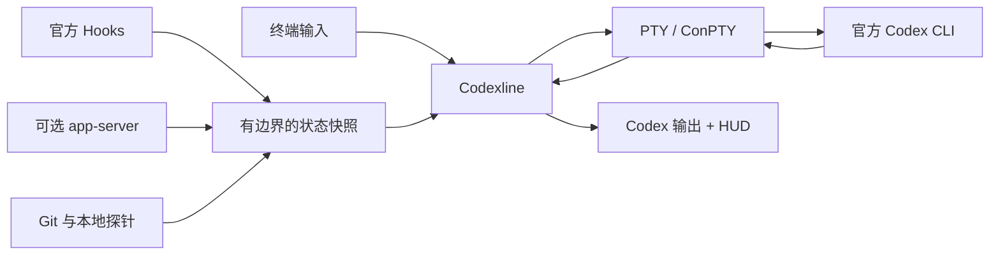

<p align="center">
  
</p>

<h1 align="center">codex-cli-codexline</h1>

<p align="center">
  面向官方 Codex CLI 的快速、美观、可配置伴生 HUD。
</p>

<p align="center">
  <a href="README.md">English</a> · <a href="README.zh-CN.md">简体中文</a>
</p>

> [!IMPORTANT]
> 当前仓库处于 **Alpha 阶段**。macOS 已在本机测试；Linux、Windows 10+ 和 WSL
> 是 CI 覆盖的支持目标，但仍需要更广泛的真实终端测试。Codexline 是独立社区项目，
> 与 OpenAI 不存在隶属或官方背书关系。

`codex-cli-codexline` 是仓库名和软件包名，安装后的日常命令保持简洁：`codexline`。

Codexline 在 PTY/ConPTY 中启动官方 Codex CLI，并在终端底部绘制自己的响应式 HUD。
它不修改、不替换 Codex，不抓取 TUI 文本，也不要求使用 tmux。

## 目录

1. [核心能力](#1-核心能力)
2. [界面截图](#2-界面截图)
3. [环境要求](#3-环境要求)
4. [安装](#4-安装)
5. [配置与启动](#5-配置与启动)
6. [配置界面](#6-配置界面)
7. [主题](#7-主题)
8. [子代理查看](#8-子代理查看)
9. [可选 Hooks 集成](#9-可选-hooks-集成)
10. [数据来源](#10-数据来源)
11. [工作原理](#11-工作原理)
12. [兼容性与当前限制](#12-兼容性与当前限制)
13. [隐私与安全](#13-隐私与安全)
14. [开发者与编码代理](#14-开发者与编码代理)
15. [参与贡献](#15-参与贡献)
16. [许可证](#16-许可证)

## 1. 核心能力

- 模型、推理等级、运行状态、当前工具和耗时
- 上下文压力、Token 计数、5 小时与周额度
- Git 分支、脏文件、暂存/修改数量、同步状态和 worktree
- 子代理、计划、压缩、权限和数据源健康状态
- 键盘优先的可视化配置界面与固定底部实时预览
- 12 套内置主题、透明配色、Unicode 和 ASCII 模式
- HUD 不可用时安全降级到官方 Codex
- 不收集提示词、回复、会话记录和文件内容

未知数据会被隐藏，不会显示成具有误导性的零值。

## 2. 界面截图

### 2.1 实时 HUD

<p align="center">
  
</p>

### 2.2 可视化配置

<p align="center">
  
</p>

以上为界面示意截图。实际颜色和模块数量取决于主题、终端宽度以及 Codex 当前可提供
的数据。

## 3. 环境要求

安装 Codexline 前，请先安装并登录官方 Codex CLI，确保 `codex` 命令位于 `PATH`。
最新安装说明请以 [Codex 官方仓库](https://github.com/openai/codex)为准。

当前从源码安装还需要：

- Git
- Rust 1.85 或更高版本
- 支持交互式 TTY 的终端

预编译和签名二进制将在后续提供。当前 Alpha 版本从源码安装。

## 4. 安装

### 4.1 macOS

尚未安装 Rust 时，执行：

```bash
xcode-select --install
curl --proto '=https' --tlsv1.2 -sSf https://sh.rustup.rs | sh
git clone https://github.com/YongshengWin/codex-cli-codexline.git
cd codex-cli-codexline
cargo install --path . --locked
codexline doctor
```

如果终端暂时找不到 `cargo` 或 `codexline`，请重启终端。Cargo 默认将命令安装到
`~/.cargo/bin`。

### 4.2 Linux

先安装编译工具链。Debian/Ubuntu 示例：

```bash
sudo apt update
sudo apt install -y build-essential curl git pkg-config
curl --proto '=https' --tlsv1.2 -sSf https://sh.rustup.rs | sh
git clone https://github.com/YongshengWin/codex-cli-codexline.git
cd codex-cli-codexline
cargo install --path . --locked
codexline doctor
```

Fedora、Arch 等发行版请先安装对应的 C 编译器、链接器、Git 和 Rust 软件包。

### 4.3 Windows 10/11

先安装官方 Codex CLI、Git、Rustup 和 Microsoft C++ Build Tools，然后在
PowerShell 中执行：

```powershell
git clone https://github.com/YongshengWin/codex-cli-codexline.git
Set-Location codex-cli-codexline
cargo install --path . --locked
codexline doctor
```

Windows 上的程序文件是 `codexline.exe`，通常位于
`%USERPROFILE%\.cargo\bin`。原生 Windows 使用 ConPTY 和 Virtual Terminal。
在更多机器完成终端恢复与信号测试前，Windows 支持仍标记为 Alpha。

### 4.4 WSL

请在同一个 WSL 发行版内安装 Codex 和 Codexline，并按照上面的 Linux 步骤操作；
不要在 Linux Shell 中直接复用 Windows 的 `.exe`。

### 4.5 仓库公开后的直接安装方式

不需要保留源码副本时可以执行：

```bash
cargo install --git https://github.com/YongshengWin/codex-cli-codexline --locked --bin codexline
```

## 5. 配置与启动

正常首次使用流程：

```bash
codexline config
codexline doctor
codexline
```

`codexline` 会启动带伴生 HUD 的官方 Codex CLI。也可以显式传递参数：

```bash
codexline run -- --help
codexline run -- resume --last
```

通过 Codexline 启动官方 Codex、但临时关闭 HUD：

```bash
codexline run -- --no-companion
```

非 TTY 输出、`TERM=dumb`、CI、`codex exec`、过小终端和显式旁路会自动使用不带
HUD 的官方 Codex 行为。

| 命令 | 用途 |
| --- | --- |
| `codexline` | 启动带 HUD 的交互式 Codex |
| `codexline run -- <参数>` | 将参数转发给官方 Codex |
| `codexline config` | 打开可视化配置和实时预览 |
| `codexline preview` | 不启动 Codex，渲染模拟 HUD |
| `codexline doctor` | 显示路径、Codex 发现、后端和数据源状态 |

> [!NOTE]
> 配置界面目前可以记录未来的“继续输入 `codex`”shim 模式，但 Alpha 版本尚不会
> 安装该 shim。在 `codexline setup` 完成前，请使用 `codexline` 启动交互会话。

## 6. 配置界面

执行 `codexline config`。保存前，所有修改都只存在于临时配置中。

| 按键 | 功能 |
| --- | --- |
| `Tab` / `Shift+Tab` | 切换第一级功能页 |
| `↑` / `↓` | 在导航层级或配置项之间移动 |
| `←` / `→` | 切换当前层级的标签页 |
| `Space` | 勾选或切换配置项 |
| `Enter` | 在任意位置校验并保存 |
| `Esc` | 放弃修改并退出 |

需要逐行交互的无障碍兼容模式时：

```bash
CODEXLINE_CONFIG_LINEAR=1 codexline config
```

PowerShell：

```powershell
$env:CODEXLINE_CONFIG_LINEAR = "1"
codexline config
```

配置文件位置：

| 系统 | 默认路径 |
| --- | --- |
| macOS / Linux / WSL | `~/.config/codexline/config.toml` |
| 设置了 `XDG_CONFIG_HOME` 的 Unix | `$XDG_CONFIG_HOME/codexline/config.toml` |
| Windows | 以 `codexline doctor` 输出为准；通常为 `%APPDATA%\codexline\codexline\config\config.toml` |

## 7. 主题

以下透明主题会保留终端原有背景：

- Inherit terminal
- 0x96f Neon
- Tokyo Night
- Catppuccin Mocha
- Dracula
- Nord
- Gruvbox
- Rosé Pine

Codex Dark 和 Codex Light 使用固定背景；Minimal 和 Mono 提供简化样式。进入
`codexline config` 的 **Appearance** 页面即可切换并实时预览。

## 8. 子代理查看

Codex 提供子代理状态时，Codexline 会在主 HUD 下方展开 Agent Inspector，并显示
`Ctrl+G focus` 操作提示：

1. 按 `Ctrl+G` 聚焦代理列表。
2. 使用 `↑`、`↓` 选择代理。
3. 按 `Enter` 查看目标和最近一条可用消息。
4. 按 `Esc` 返回或关闭详情。

当前 Codex 集成无法提供的字段会自动隐藏。

## 9. 可选 Hooks 集成

仓库内置的 `codexline-events` 插件可以提供工具、代理、计划、权限和压缩事件。克隆
仓库后执行：

```bash
codex plugin marketplace add "$PWD/integrations"
codex plugin add codexline-events@codexline-local
```

PowerShell：

```powershell
codex plugin marketplace add "$PWD\integrations"
codex plugin add codexline-events@codexline-local
```

在新的 Codex 会话中使用 `/hooks` 检查并信任命令。Codexline 未运行时，适配器不会
执行数据转发。

## 10. 数据来源

Codexline 合并三个有边界的数据来源：

1. 官方 Hooks：生命周期、工具、权限和代理事件。
2. 可选只读 app-server sidecar：额度和账户状态。
3. 带缓存的本地探针：Git、worktree、目录和会话耗时。

默认的 `safe sidecar` 不会在 Codex TUI 和服务之间插入代理。
`remote_proxy = true` 属于实验功能；连接建立后若代理断开，可能终止交互式 TUI，
因此默认关闭。

## 11. 工作原理



Codexline 从子终端高度中预留 HUD 行，以字节流转发 Codex 输出，并使渲染工作远离
转发热路径。它只在伴生进程内部关闭 Codex 原生 footer；用户显式传入的
`-c tui.status_line=...` 配置仍具有最高优先级。

## 12. 兼容性与当前限制

| 环境 | 后端 | 当前验证程度 |
| --- | --- | --- |
| macOS | POSIX PTY + ANSI | 已在本机测试 |
| Linux | POSIX PTY + ANSI | CI 目标；真实终端矩阵待补 |
| Windows 10/11 | ConPTY + Virtual Terminal | CI 目标；真实终端矩阵待补 |
| WSL | Linux PTY 后端 | 支持目标；真实终端矩阵待补 |
| 非 TTY / CI / 管道 | 直接降级 | 已有自动化测试 |

当前 Alpha 限制：

- 尚无签名预编译二进制和包管理器安装源。
- 尚未实现 `codexline setup`、自动 `codex` shim 安装和卸载。
- 稳定渲染方式目前是底部 dock；跟随输入框的 attached 布局仍是实验方向。
- 丰富实时字段取决于已安装 Codex 版本暴露的能力以及可选 Hooks 集成。

## 13. 隐私与安全

- 不收集提示词、回复、会话记录、命令输出或文件内容。
- 不解析 Codex 私有 SQLite 或 rollout 格式。
- 不修改官方 Codex 安装。
- 动态显示文本会过滤终端控制序列注入。
- 集成消息仅在本机传递，具有大小边界并限定到当前会话。
- PTY 接管前发生故障时会直接降级到官方 Codex。

## 14. 开发者与编码代理

开始工作前按顺序阅读：

- [`AGENTS.md`](AGENTS.md)：英文、中文、日文三语的强制贡献规则与代理约束。
- [`DESIGN.md`](DESIGN.md)：架构、兼容性、安全和性能不变量。
- [`docs/adr`](docs/adr)：已接受的架构决策。

必须执行的验证命令：

```bash
cargo fmt --all -- --check
cargo clippy --workspace --all-targets --all-features -- -D warnings
cargo test --workspace --all-features
cargo build --release
```

文档必须明确区分已实现功能、未来设计和真实平台验证。禁止 patch Codex、抓取终端
文本或读取私有会话记录。

## 15. 参与贡献

欢迎提交 Issue 和 Pull Request。修改 PTY 所有权、公开配置、插件协议、更新信任链
或状态 schema 前，请先建立 Issue。PR 应说明测试平台、降级行为、安全影响和验证命令。

## 16. 许可证

MIT，详见 [`LICENSE`](LICENSE)。
